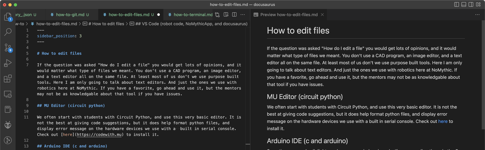

# How to edit files

If the question was asked "How do I edit a file" you would get lots of opinions, and it would matter what type of files we meant. You don't use a CAD program, an image editor, and a text editor all on the same file. At least most of us don't we use purpose built tools. Here I am only going to talk about text editors. And just the ones we use with robotics here at NoMythic. If you have a favorite, go ahead and use it, but the mentors may not be as knowledgable about that tool if you have issues.

## Notepad on Windows, TextEdit on Mac

If you need to edit one file, these can work fine, but using one of these other editors makes editing, searching, and navigating between the files in a project much easier.
## MU Editor (circuit python)

We often start with students with Circuit Python, and use this very basic editor. It is not the best at giving code suggestions, but it does help format python files, and display error message on the hardware devices we use with a  built in serial console. Check out [here](https://codewith.mu) to install it.

## Arduino IDE (c and arduino)

Sometimes we code sik lights and sensors on helper boards. If we are coding these in the C like Arduino code, this IDE makes sense, and since the 2.0 version was released, it has become much better. It has a built in serial console, board library, and code library management. V2 has much improved code suggestions. Check out [here](https://docs.arduino.cc/software/ide-v2) to install it. 

## VS Code (robot code, NoMythicApp, and docusaurus)

VS Code has become a defacto stndard editor in many circles due to it being free, but as powerful and extensible as it's expensive professional cousins. We use it for lot of things at NoMythic. It is currently the standard recommended editor for createing java based robot code. For developing java robot code, I recommend following the [instructions at First](https://docs.wpilib.org/en/stable/docs/zero-to-robot/step-2/wpilib-setup.html) and getting the software bundle that includes it. Be sure to check the box that installs VS Code.

The NoMythicApp is also being developed in Typescript/Javascript using VS Code. It is recommended but not required to use it for development. You can use the VS Code that came with the FRC install, or if you do not need those tools, download it [here](https://code.visualstudio.com)

Docusaurous pages are written mostly in markdown. This means any text editor will do, but useing the above link to install VS Code will allow you to see an immediate accurate preview of the markdown (.md) file that you are edting. Example:

VS Code also offers Git integration that can help with pulling and pushing files to GitHub.

## IntelliJ IDEA Community Edition

It seems like most Java programmers like to use IntelliJ. There is a free version called the community edition, and it will work really well to write java code. It was originally created for Java codeing (now does a lot more) so as you can expect there are some pretty cools tools changing and modifying and navigating your java code. you can download it [here](https://www.jetbrains.com/idea/) There is also a [WPILIB plugin](https://plugins.jetbrains.com/plugin/9405-frc) maintained by an FRC team.

IntelliJ also offers Git integration that can help with pulling and pushing files to GitHub.
