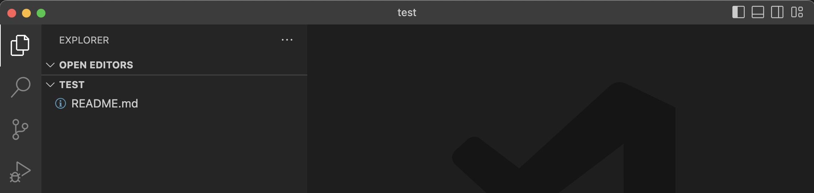

# How to Git with VSCode

You will need access to the NoMythic Github account to follow along with this how-to. You can clone the repo without access, but you will not be able to push changes back.

When you first open VSCode it looks like this.

## Git Clone

If code was already on your machine, you can Open Folder. We are going to Clone Repository. Click that, then pick Clone From Github. You will then be asked to approve access of VSCode with Github. Go ahead and do that. When you get sent back to VSCode you should see a list of projects at the top of the screen.

Your list may not look like this exactly. What we want is the 2491-NoMythic/test repo that is the first in this list.

You will have to give the repo a base location. The test folder will be created for you. We like to use `~/source/repos` on the programming computers.

If the clone worked, you should the test repo opened with one file in it. 

Cloning a repo copies the files from a remote location, such as Github, and puts them locally on our machines. It also brings with it some Git information that is used to track changes and branches and stuff.

## New Branch

Branches? Oh yea, we should create a new branch before we start making changes. A branch is a collection of edits and changes that you have made. It allows us to group these things together so we can show others our changes, or know what group of things changed later. Lets make one.

 

At the bottom of that image, in the red oval, we are told we are on the main branch. This is where everyones code will eventually live once we merge branches. Click on it, and we can click on the Create new branch... Now give it a name. For this it can be anything, like my-branch, but you should give it a real name on a real repo like climber-encoders or something.

Instead of showing main at the bottom, it should show your branch name now.

## Source Control Pane

Before we change anything, lets take a look at what Git tells us so far. Click on the Source Control icon on the left hand side.(circled in red)

Not much there is there? This means that we have no changes and nothing to commit. We will see that change in a bit.

Ok. Lets make a change to the README.md file.

Click on the Explorer icon to see the file list, and click on the README.md file. Should look like this.

Because this is a test repo, and others are using it to make changes, then the screen might not look the same, but that is ok. We just want to make a change to the README.md file. Change the text or add a line. Then save.

Head back to the Source Control view again. It's different now.

Notice that there is a (1) beside the Source Code icon. There is one file changed. And that file, README.md is shown in the list of changes. If there were other files in the project that had been changed or added you would see them here too.

## Git Diff

Now click on the README.md file name on the left. The editor will be replaced with a different view.

This is called a diff. It shows the changes that have been made since the last commit. On the left is what the file was before changes, and the right is the new changes. See the (+) beside line 4 on the right? That is the new line I added.

## Git Stage

Lets get these changes added to Git now. First we have to deal with our local git. The first thing we do is stage our changes. On the right of the file name README.md you will see some icons. One is the (+). Press that to stage the file. If you hover over the word Changes you will see another (+) option to Stage All Changes. Press either one. 

The view has changed again. The README.md file has moved from Changes to Staged Changes. The diff has changed too. The files are now the same, because you don't have changes on the branch anymore.

## Git Commit and Publish

The file is now staged, not committed. Just above the big blue Commit button is a text box. Here put a short comment. Don't say "added nice to see you", say something like "updated README for tutorial". Then, you can press Commit.

The button changes to Publish. Your files are now in Git locally, but we still need to Push, or Publish the files to Github. Press the Publish button to do this. You don't see much happen here, but if you don't get an error message you can assume it worked.

## Creating a PR (pull request)

Now we can go take a look at Github just like we would have in the How To Git (terminal) tutorial.

[Goto GitHub](https://github.com/2491-NoMythic/test) and the NoMythic test repo.

It will look something like that above. If you come to the repo right away you will see the green Compare and Pull Request button. Click this. (If you don't see it, you will need to go to the Pull Requests tab and go through the Create Pull Request flow.)

You will see two green buttons. Since we just recently pushed code, the first one is a shortcut to create a PR for our new code push. So click this first button.

Make sure you have a good title and description, and press the Create Pull Request button. Now you can invite others to look at your code.

Look at this new page. Click on the "Files Changed" tab at the top. You should see something like this:

This is how someone looking at your PR can see your changes. The color coded bars at the bottom contain the code code changes. This one is simple. It shows the line that was there in red, and the new lines in green.

If you are reviewing someone elses code, you would press the Review Changes button, maybe leave a comment for them. Maybe suggest changes. We are just going to Merge. Click the Conversation tab at the top to get back to the title/description ares. Just underneith is the Merge button. Press that. That will merge our code into the main branch (finally!)

Now people that go to the repo, or clone the code will see our changes. Just one bit to do.

## Clean up

Click on the name of your branch at the bottom of the screen. Select main branch from the list. Now click the circle with arrows right beside it on the bottom of the screen. This will do a pull and pull from git the changes you made in your branch. Now you are all set to repeat this process.

