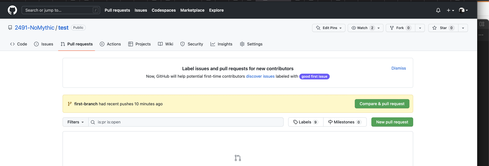

# How to Git

## Installing Git

If you are on a Mac, pat yourself on the back and go to the next section, git is built in.

On Windows, I suggest installing the GitBash *does github desktop stil have command line?*. This will give you a terminal with the git tools installed. See [Install Git](https://www.gitkraken.com/learn/git/git-download)

## What is Git?

Git is a way to store and manage versions of things like text files and images. We use it to manage our source code for the robot and for docusaurous. Git is not the only way this could be done. These systems are called Version Control Systems. Git is very popular and what we use. We can use a command line, or various programs to do this. We will got to that later but we need to talk about the why.

## Why use Git?

Git is a distributed version control system. This means that there doesn't have to be one server that holds all the code. In practice, most teams use someplace like GitHub (or Bitbucket, etc) to be the "official" repository of their code. We do too. But that does not mean that you edit the code on GitHub. You stil edit code locally on your computer and then "push" your code to the server. This is good becuase many people can work on one file, or files on their own computer, and then put them together on the server, called merging. We do this so that the last person to upload code doesn't win. We want to get everyones contributions. Lets back up.

## How does this work?

You get a "main" and you get a "main" and you get a "main. When I said there are versions of a file there are actually versions of a group of files. This group is called a branch. The main, or official branch is called "main" in most of our repositories. (Old ones were called master - we and the community have stopped calling it that) When you work on changes you will work on a different branch. Rember how I said this was distributed? That means that each computer that is working with a repository will have the main branch on their machine. Everyones main branch might not have exactly the same changes, but they could, by syncing with the main branch on Github.

## No really, how does this work?

What I wanted to convey was that there is a server that has code, and you have code, and your teammates have code, and we can all sync up an resolve our changes. So lets look at that in practice. 

To do this, we wil walk though a process of making a change to a repo. This will assume you have git installed.

Here is a summary of what we are about to do, called a git workflow:
1. Make a copy of a test repo on our own computer (called making a clone)
2. Create a new branch from the main branch
3. Make a change to the readme file
4. Save those changes locally (called a commit)
5. Push those change back to our remote repo on Github
6. Create a pull request on Github so that others can review our changes
7. Merge our changes into the main branch on Github
8. Do some local cleanup.

This seems lke a lot of steps. Why can't we just drag a file to Github like you would dropbox? If we did that, then the last person to make changes would overwrite whatever changes are there. We don't want to clobber the hard work someone else has done. So lets see how this workflow works in practice. 

### 1) Clone the test repo from Github

First you need to find the repo you want to clone. This test repo is at [https://github.com/2491-NoMythic/test](https://github.com/2491-NoMythic/test) Navigate here. Click on the green Code button. The screen will look kinda like this:

We need to grab the URL of the repo, and if you click the double box icon next to the line that starts with https it will copy the url to the clipboard (`https://github.com/2491-NoMythic/test.git`)

At a terminal, navigate to your `code` folder. After we clone this repo, there will be a folder called `test` there. type `clone ` and paste the url. `git clone https://github.com/2491-NoMythic/test.git`. Now `cd test` to navigate into the newly created test folder. 

New command: `git status` at any time to get info about the current branch. Doing that now will tell you that you are on the main branch:
```bash
On branch main
Your branch is up to date with origin/main.

nothing to commit, working tree clean
```
What is origin/main? That refers to the remote repository, the one on Github. We just got what was there, so we are uptodate. We have not made any changes, so there is noting to commit. We will talk commits later.

## 2) Create a new branch
Type `checkout -b first-branch`, and you will be informed you switched to the new branch. (I know, the command is weird) Checkout is how we switch branches. Try `checkout main`, and you will be back on the main branch. `checkout first-branch` with no -b and we are back on the first-branch we just created. The -b switch means to checkout (switch to) a branch but create it first.

## 3) Change the README.md file

You can edit this file however you would like. You could use nano, Notepad, TextEdit, what ever works. Just not MS Word or something you can use to apply styling. Just a simple text editor. Add some text to the file. For now, just add one line, like "Hello my edit", and save it.

Now type `git status`. What changed since last time?

```bash
On branch first-branch
Changes not staged for commit:
  (use "git add <file>..." to update what will be committed)
  (use "git restore <file>..." to discard changes in working directory)
	modified:   README.md

no changes added to commit (use "git add" and/or "git commit -a")
```

Lots of stuff! We have a message telling us that there are files not staged for commit, and they are the README.md file. It was modified (as opposed to added or deleted)

# 4) Lets add and commit

Just like the message said, lets add our file. `git add README.md` Then try `git status` again. 

```bash
On branch first-branch
Changes to be committed:
  (use "git restore --staged <file>..." to unstage)
	modified:   README.md
```
We are gitting closer to making git happy now. We have 'staged' the README.md file and we can now commit it. We want to give our commit a message, so `git commit -m "updated readme"`. Now what does `git status` tell us?

```bash
On branch first-branch
nothing to commit, working tree clean
```

## 5) Can other see our changes?

Not yet. We have committed (saved) our changes to our branch, but we have not 'pushed' the changes to GitHub yet. When we do a push, we will be pushing our code to the remote that we got the code from, which in our case was Github, and the NoMythic/test repo.

If you have a new version of Git installed, you should be able to just say `git push` and it will work. Older version required `git push origin first-branch`

## 6) Now others can see the code?

Yup, but not as easily. We now have a branch called first-branch that is on Github, and people could download it, but it isn't in main, and we want to show others what changed and make sure our new changes look right. Lets make a PR or pull request.

When we did a push, one of the things on the console was this:
```bash
remote: Create a pull request for 'first-branch' on GitHub by visiting:
remote:      https://github.com/2491-NoMythic/test/pull/new/first-branch
```

You can command-click this on Mac, copy and paste that URL into a browser, or navigate to [https://github.com/2491-NoMythic/test](https://github.com/2491-NoMythic/test) and then click on the Pull Requests tab at the top.



You will see two green buttons. Since we just recently pushed code, the first one is a shortcut to create a PR for our new code push. So click this first button.

Make sure you have a good title and description, and press the Create Pull Request button. Now you can invite others to look at your code.

## 7) Time to merge

Look at this new page. Click on the "Files Changed" tab at the top. You should see something like this:


This is how someone looking at your PR can see your changes. The color coded bars at the bottom contain the code code changes. This one is simple. It shows the line that was there in red, and the new lines in green.

If you are reviewing someone elses code, you would press the Review Changes button, maybe leave a comment for them. Maybe suggest changes. We are just going to Merge. Click the Conversation tab at the top to get back to the title/description ares. Just underneith is the Merge button. Press that. That will merge our code into the main branch (finally!)

## 8) Time to clean up

Ok, lets go back to our main brnch, `git checkout main`. Look at the README.md file for our changes. Oops. They are not there? Where did they go? Well, we merged them into the main branch on Github, but we haven't updated the main branch on our local machine yet. That easy. Just `git pull`. Now you will see the change in the readme. 

One last thing. We don't need the branch anymore, so lets delete it with `git brnach -d first-branch`

And we are done.

## What else?

The above workflow will 'Just Work' most of the time, but imagine that two people worked on the same file at the same time. We would have to put all of those changes togeter. Sometimes git can handle this, orther times you will need to do a merge. But that might be better explained in person.

## Other Resources

[GitKracken tutorials](https://www.gitkraken.com/learn/git) go more indepth than here

[How to install Git](https://www.gitkraken.com/learn/git/git-download) if you are on windows

[GitHub Desktop](https://desktop.github.com) for a GUI client

Mess things up? Check out [Oh Shit Git](https://ohshitgit.com)
