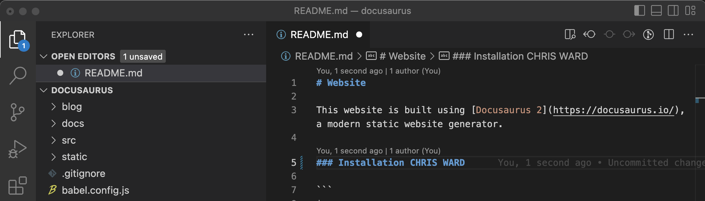
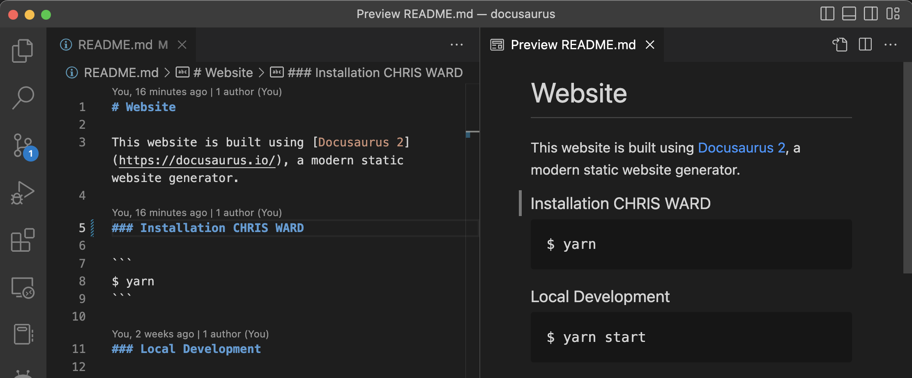

# How to VS Code

## What we use it for + Installing

VS Code has become a defacto stndard editor in many circles due to it being free, but as powerful and extensible as it's expensive professional cousins. We use it for lot of things at NoMythic. It is currently the standard recommended editor for createing java based robot code. For developing java robot code, I recommend following the [instructions at First](https://docs.wpilib.org/en/stable/docs/zero-to-robot/step-2/wpilib-setup.html) and getting the software bundle that includes it. Be sure to check the box that installs VS Code.

The NoMythicApp is also being developed in Typescript/Javascript using VS Code. It is recommended but not required to use it for development. You can use the VS Code that came with the FRC install, or if you do not need those tools, download it [here](https://code.visualstudio.com)

Docusaurous pages are written mostly in markdown. This means any text editor will do, but useing the above link to install VS Code will allow you to see an immediate accurate preview of the markdown (.md) file that you are edting. 

## Get Started

When you first open VSCode you will see something like the picture above. It is designed to work with a project, so we are going to open a folder for a project. For this example we will use our docusaurus project. If you don't have it dowloaded yet you can still follow along, maybe pick another folder on the computer.

>If you don't have docusaurus you might want to check out [How to Git](./how-to-git-broken.md) to use Git from the command line, or follow the [How to Git with VSCode](./how-to-git-with-vscode.md) to learn how to use Git inside VSCode. Or just pick a folder on your computer that has text files.

So click Open Folder. Navigate to the docusaurus folder and press the Open button.

VSCode expects you to work on a project, not just one file. The file list is on the left. The top shows open editors, which right now is just the Get Started page, then the open folder, which is Docusaurus.

## Icons on left

Lets go through the icons. At the top left you see the stacked documents that means the explorer view. Under that is search. Under that is [Source Control](./how-to-git-with-vscode.md). Below that is debug, but we will skip that one. After that, the rubics cube missing the top corner is plugins. I have some other plugins installed here, so the icons below are from them. You can check what plugins are installed and look for other there.

## Editor
Lets look at the editor. It is the section on the right that right now says Get Started in a tab. Click on another file on the right hand side. It opens in a tab. (If you want it to "stick" you would double click) You can have many tabs open if you wish.

Make a change to one of the files. 

Beside the file name you see a dot. That means the file has not be saved. Press Command+s or CTRL+s to save the file. When you save the dot will go away and the file in the Explorer will have a M beside it if this is a Git based project.

Make sure you click on the file you were editing. Press Command-f or CTRL-f and you will get search for the current file. If you press the little arrow in the search you will get another text box for replace.

## Search all

There are a couple of ways to look up and find text. You can use the search icon on the left, or Shift+Command+f or Shift+CTL+f. That will give you a list in the left pane of all the files that have your search term. You can also Command-p or CTRL-p to find files by name.

## Preview for Docusaurus

It is sometimes nice to have a preview of files, like the .md files that we usually use for docusaurus. Lets show that.

If first pressed the explorer icon so that the left pane went away. My screen was too small otherwise. Then press the icon in the other red circle. This is preview. If will open to the right of the editor.

## Terminal

Click the word Terminal, then New Termminal in the menu bar at the top of the screen. This will open the pane at the botom with the Terminal open. It usually opens at the location of your project. (my terminal will look different than yours). You can execute any terminal commands here. See [how to terminal](./how-to-terminal)
d
## Special Functions

Shift-Command-p or Shift-CTRL-p will bring up a list of actions that you can do. They are often supplied by functions and use the file type to present options that make sense, but you can search for others at the top.

## Build Robot Code

You have to have the WPILib plugin for this. If you do that same -p command as above and type wpilib into the command search, you will see all the wpilib commands. The most often used are to build and deploy robot code.

See the [WPILib page](https://docs.wpilib.org/en/stable/docs/software/vscode-overview/vscode-basics.html) for a little more on the plugin. 
