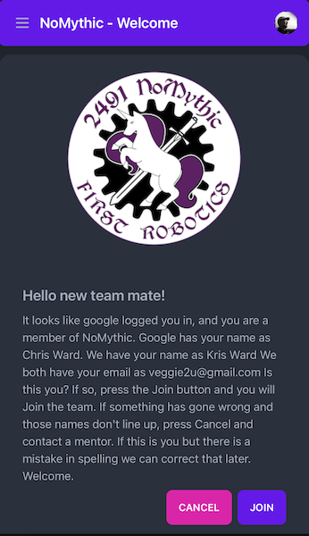
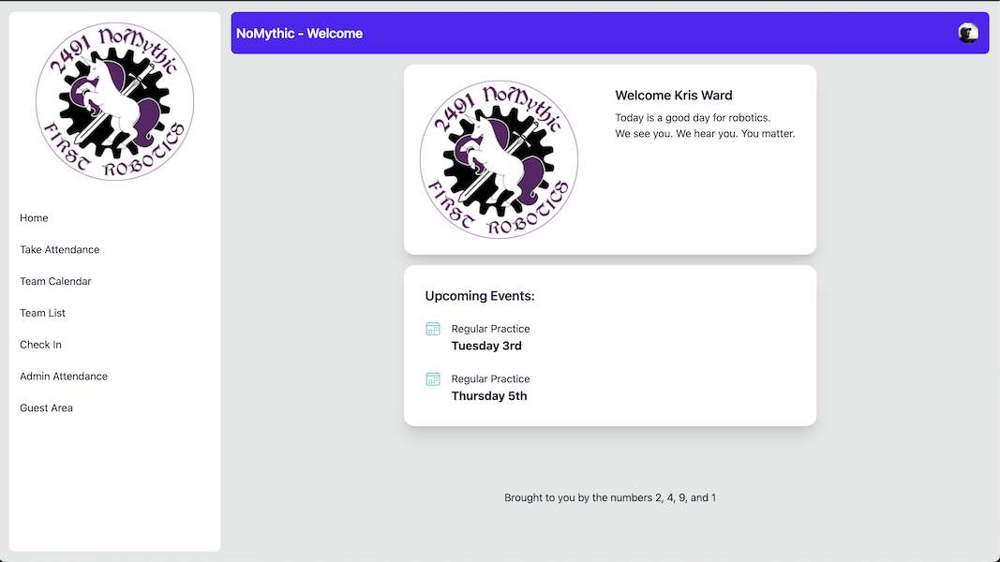
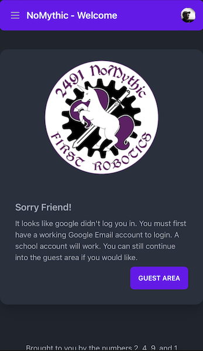
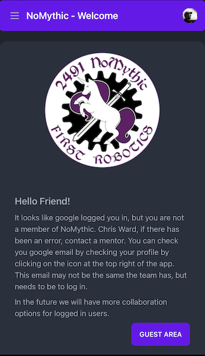

# How to use the app

The app works great on both phones and desktops. These docs will try to show images of both. You can use different themes, so the images might be from different themes. We are currently checking the light and dark themes to make sure they work well.

The data you will see is from our development server which uses fictitious people and data. 

## Logging in

The app is deployed to [2491nomythic.netlify.app](https://2491nomythic.netlify.app)

The first screen you will see is this:

You will need to log in with the google account that you gave when you signed up or applied to NoMythic. For students, this will be your Avalon or GRS email. If you don't remember what account you use with NoMythic an admin user can look you up. If you have have issues you will need to see mentor Chris. A user admin screen is coming.

## Welcome screens

If you are successful logging in, and this is your first time, you will see this join screen:

This screen will allow you to join the team and link your google login with the information we have. Google will not see any of your information entered in the app.

If you join, or any other time you login, you will see the standard welcome screen.

The biggest difference is in the real estate. On the desktop version you will see the menu at the left at all times. On a phone you will see a hamburger menu in the top left of the screen. Press this to see the menu. The options you see in the menu is determined on whether you are a general member, a captain, or a mentor.

There are a few other welcome screens.

If there is an error logging in with google you might see this screen.

In practice, I never see this screen. Google usually just shows its own error page if you have issues logging into google.

The last page shows up if you log into a Google account, but we don't have a matching email for you.

This will usually happen for someone with more than one google account trying to access the NoMythic app, and they used the wrong one. If you have this issue you will need to see mentor Chris. A user admin screen is coming.

## Auto logging in

After you have joined and have a successful login, the next times get simpler. Google assumes that you want to allow NoMythic to continue to get access based on its login until you remove it. So when you press the Login button google sends you right to the app without any screens where you have to do anything. You go straight to the app. The downside to this is if you logged in with the wrong account. You will need to find the google page in settings that lists the applications you have authorized and remove it, or you will have to have your gmail address changed by mentor Chris.
