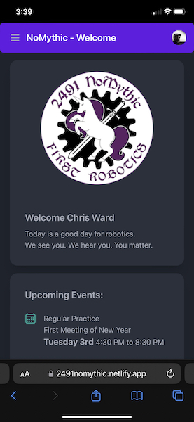
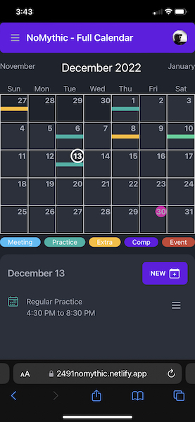
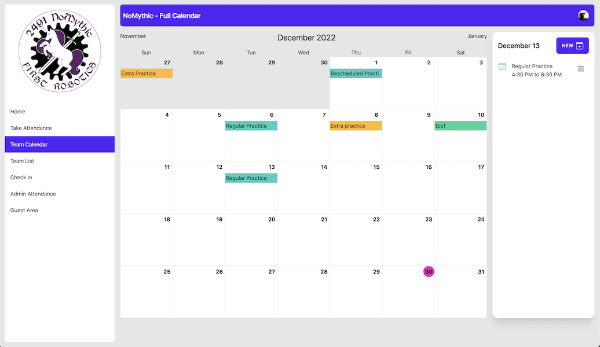

# What is the NoMythicApp

The NoMythicApp is a web based app that will provide access to the day to day housekeeping and admin type stuff that a First Robotics team has to do to keep going. Such as keeping track of student information and taking attendance. Right now it might be NoMythic centric, but the hope would be that other teams would be able to deploy it and use it too.

Since most students run their lives through their phones, the goal is to keep the app as responsive as possible. Most tasks that someone would have will work on phones. On desktop, some of the screens are able to utilize more of the space.

## What does it look like?

As you can see, the app is responsive, looking different on phones vs desktops. It also supports themes.

## What are the main features?

* A team calendar that lists the team practices and events
* Ability to create practices and events on the calendar
* Attendance pages to allow captains and mentors to take attendance
* Admin screens to show how many people attended what meetings
* Member attendance screens to show how often specific members are coming
* A team list of all students and mentors on the team
* Ability of the team member to update their own profile information
* Admins can add/remove/edit a team members information
* A checkin page that allows a mentor to record how a team member felt that day

## Can I get a login?

Right now, you need to be on the NoMythic team to get a login. If you are, you can access it [here](https://2491nomythic.netlify.app/) The app uses google to authenticate you. You then have to be a member to actually use the app. If you are on another team and are interested in trying this out, we should talk. Our team is using it, but I would say it is a beta right now. Chris Ward - veggie2u@cyberward.net

## Can I learn more?

Sure! The code is open source, and hosted on [Github](https://github.com/2491-NoMythic/NoMythicApp) There is some info in the readme file.

Want to know how to use it? There is a [walk through](./how-to-use) of most of the features.

There is also more on the [technical](./technical_info) side of things too.
