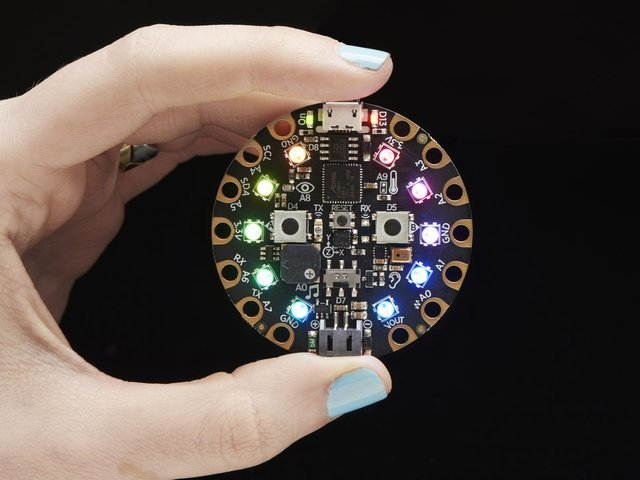

# Circuit Python: Hardware
Our devices is the [Circuit Playground Express.](https://www.adafruit.com/category/965)

*A Circuit Playground with Activated Lights*

This is a really cool little device. It has a lot built in. There are neopixels (RGB lights) arranged in a ring. Around the outside of that are touch sensors. There is a buzzer, a microphone, 2 physical buttons, a switch, and an accelerometer (detects motion). There is a lot to play with here, but programming it is not an insurmountable challenge. Adafruit has made programming it very accessible, hence our use as an intro tool.

These boards can be programmed in many different ways. We will be using Circuit Python, but you can use Arduino, and even MakeCode. See the below links for more on those things.

To make these different environments work, there is a boot loader. If the board doesn't seem to work, try updating that. There is a process for this that is defined [here.](https://learn.adafruit.com/adafruit-circuit-playground-express/updating-the-bootloader)

There is lots to read up on if you want, but head right to Getting Started if you want to skip the details.

To dive deeper, check out [this page](https://learn.adafruit.com/adafruit-circuit-playground-express)
If you are curious about the ecosystem, see this [hardware overview page](https://www.adafruit.com/category/965).

## Sources
[GitHub Origin](https://github.com/2491-NoMythic/circuitPython/wiki/2.Hardware)