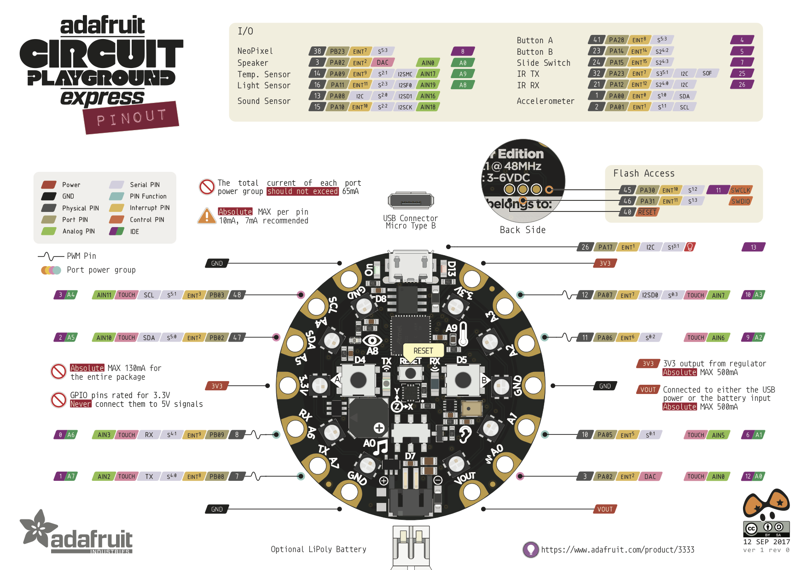

# Circuit Python: Intro
Welcome to the CircuitPython wiki!

We will be using CircuitPython, and the Circuit Playground Express from Adafruit to learn the basics of programming.

Start by getting more information on the hardware device, on the hardware page.

Then start to learn about programming on the Circuit Playground, see the programming page.

After getting things set up, we will learn programming step-by-step

*A Circuit Playground*

## Sources
[GitHub Origin](https://github.com/2491-NoMythic/circuitPython/wiki/1.Home)